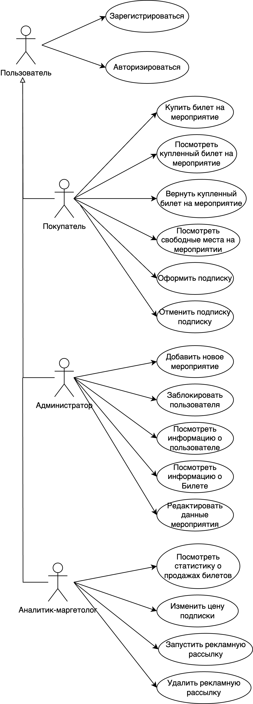

# Выполненное задание

## Стейкхолдеры

1. **Покупатели билетов** - клиенты хотят иметь доступ до покупки в любое время и без задержек, особенно при появлении билетов в продаже.

2. **Команда разработки** - отвественны за масштабирование и обеспечение надежности системы, расширение функциональности.

3. **Менеджмент компании** - им необходимо отслеживать удовлетворенность клиентов сервисом, успешность работы групп поддержки и разработки.

4. **Партнеры онлайн-площадки продажи билетов** - заинтересованы в легком способе интеграции с целью обмена информацией о доступности билетов.

5. **Партнеры из "Один-Популярный-Мессенджер"** - разрабатывают интеграцию мессенджера с площадкой.

6. **Маркетинговый отдел** - проводят рекламные компании площадки, создают акции на покупку подписки, проводят исследования о популярности мест и исполнителей, анализируют предпочтения пользователей.

7. **Финансовый отдел** - напрямую заинтересованы в безопасности проводимых платежей за билеты и возможности возвратов в соответствие с политикой компании и законодательством.

8. **Служба поддержки** - им необходимо иметь возможность быстро узнать информацию из системы для решения проблемы пользователя и доступ до системы для решения возникших проблем.

9. **Администратор** - добавляет информацию о проводимых мероприятиях, размещает схемы залов, устанавливает цены.

---

## Функциональные требования

1. **Доступ в систему**:

    1.1. Регистрация новых пользователей.

    1.2. Аутентификация и авторизация пользователей.

2. **Операции с билетами**
 
    2.1. Возможность покупки билетов.

    2.2. Возможность возврата билетов до начала мероприятия.

    2.3. Отображение доступных мест для покупки.

    2.4. Просмотр купленных ранее билетов.

3. **Операции с подпиской**

    3.1. Возможность оформить подписку на различные преференции

    3.2. Возможность отменить подписку.

4. **Обработка платежей**

    4.1. Возможность оплаты билетов.

    4.2. Возможность возврата оплаты за приобретенный билет.

    4.3. Возможность разовой оплаты подписки.

    4.4. Возможность ежемесячной автоматической оплаты подписки.

5. **Интеграция со сторонними площадками**

    5.1. Возможность интеграции со сторонними площадками для обменом информации о доступности билетов.

    5.2. Возможность интеграции со сторонними сервисами для продажи билетов.

6. **Информирование пользователей**

    6.1. Уведомление о доступности билетов через мессенджер. (Доступно в подписке)

    6.2. Уведомление пользователей о заканчиавющейся подписке через мессенджер. (При наличии подписки)

    6.3. Рассылка рекламных акций пользователям через мессенджер.

7. **Администрирование**

    7.1. Добавление информации о мероприятии.

    7.2. Редактирование информации о мероприятии.

    7.3. Получение информации о пользователе.

    7.4. Получение информации о статусе билета.

    7.5. Блокировка пользователей.

8. **Аналитика и маркетинг**

    8.1. Возможность получать статистику о покупках билетов.

    8.2. Возможность изменять цены на подписки.

    8.3. Возможность добавлять рекламные рассылки.

---

## Диаграмма вариантов использования для функциональных требований

---

## Перечень сделанных предположений

1. Необходимо иметь возможность проведени оплаты на стороннем сервисе (например, ЮКаssа)

2. Аналитика и отчетность о продажах, позволяющая отслеживать популярность различных мероприятий и эффективность маркетинговых кампаний потребуется.

3. Для платформы важна кросс-платформенность, чтобы обеспечить доступ к покупке билетов с любого устройства.

4. Дополнительная функциональность для владельцев подписки будет добавляться со временем.

5. Службе поддержки будет необходим доступ к информации о пользователях и купленных ими билетах.

---

## Нефункциональные требования

1. Необходим надежный механизм защиты от "двойной" продажи одного и того билета.

2. Масштабируемость. Имеется большое количество пользователей. Возможно, даже, в разных городах и странах.

3. Доступность. Система должна оставаться доступной даже в момента пиковых нагрузок (появление билетов в продаже) до 10 000 запросов в секунду.

4. Производительность. Система должна обеспечивать быстрое время отклика (< 0.5 сек) на запрос пользователя.

5. Простота интеграции с внешними площадками покупки билетов.

6. Кроссплатформенность интерфейса пользователя для покупки билетов для охвата как можно большего количества платформ.