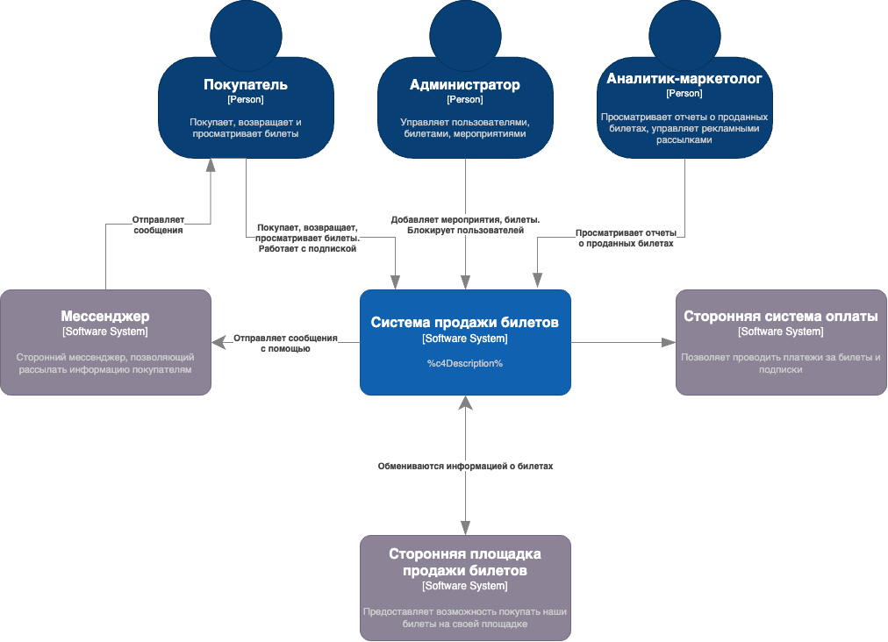
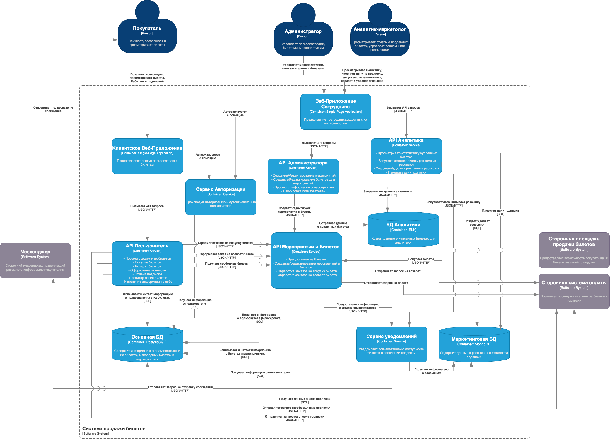
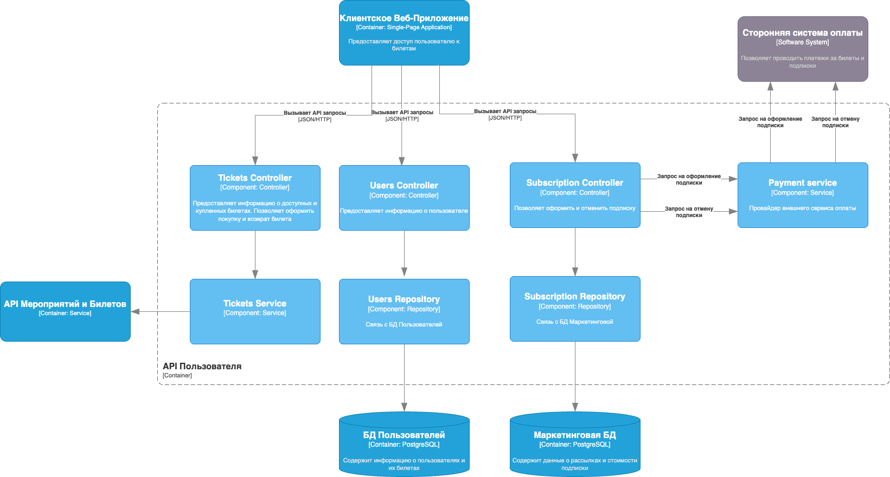
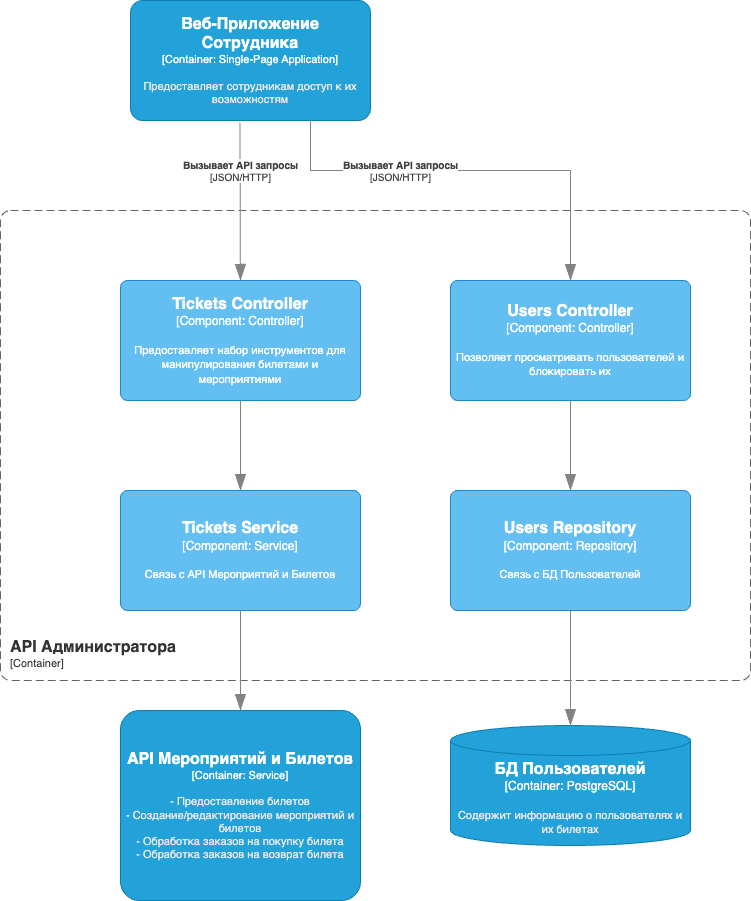
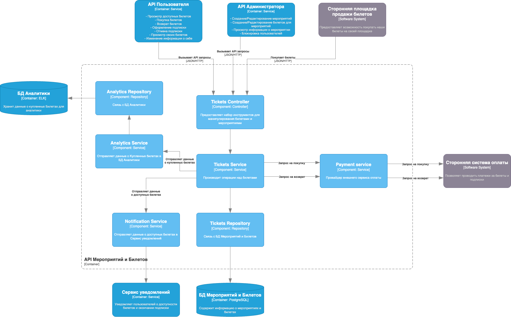
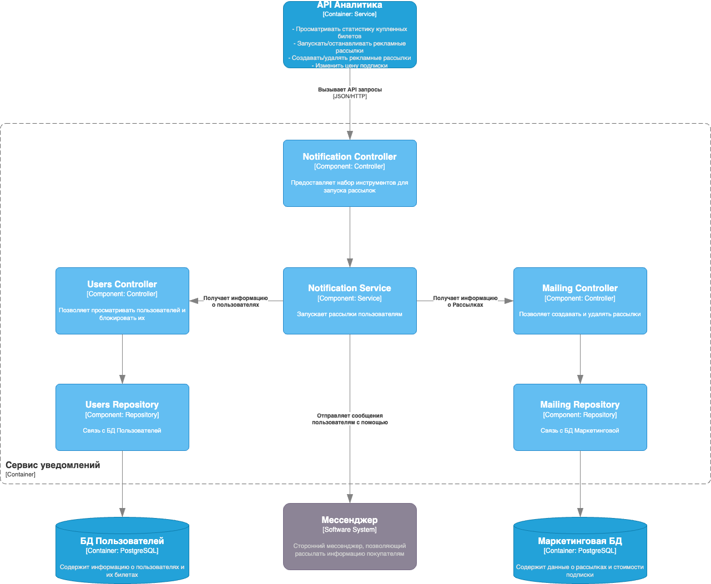
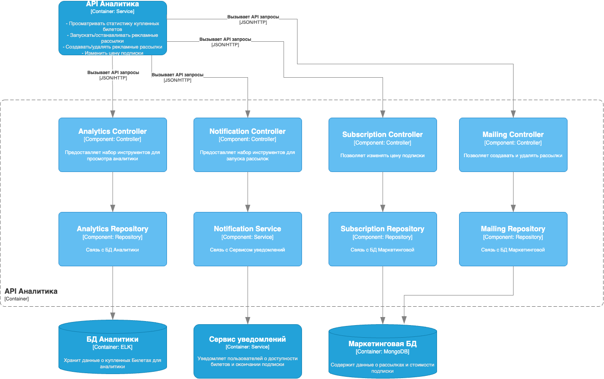

## Диаграмма контекста

## Диаграмма контейнеров

В качестве архитектурного стиля выбрана Микросервисная архитектуры. Так как она позволит разделить разные зоны ответственности между разными сервисами. Кроме того, позволит дорабатывать их независимо друг от друга, разворачивать отдельно.

## Диаграмма компонентов API Пользователя

## Диаграмма компонентов API Администратора

## Диаграмма компонентов API Мероприятий и Билетов

## Диаграмма компонентов Сервис Уведомлений

## Диаграмма компонентов API Аналитика
