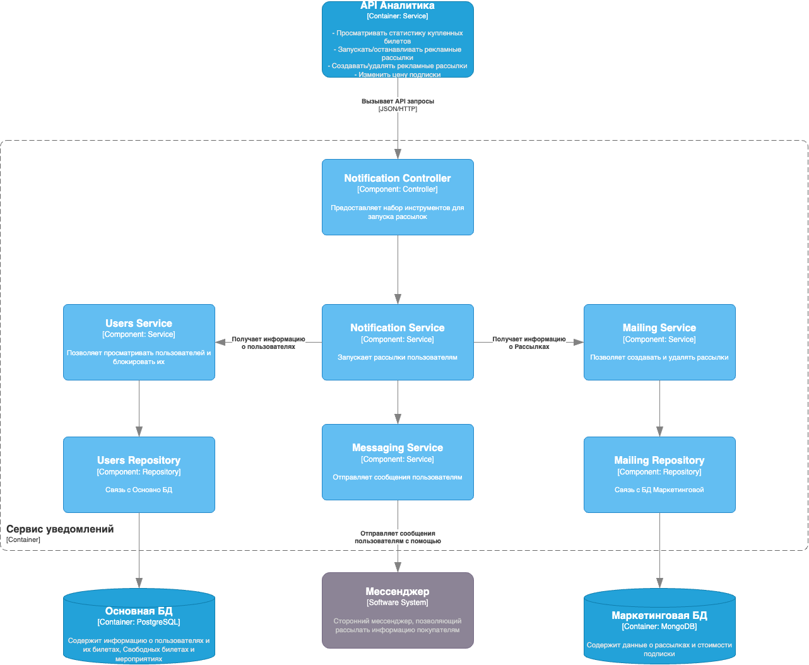

## Диаграмма контекста

## Диаграмма контейнеров

## Диаграмма компонентов API Пользователя

## Диаграмма компонентов API Администратора

## Диаграмма компонентов API Мероприятий и Билетов

## Диаграмма компонентов Сервис Уведомлений

## Диаграмма компонентов API Аналитика
