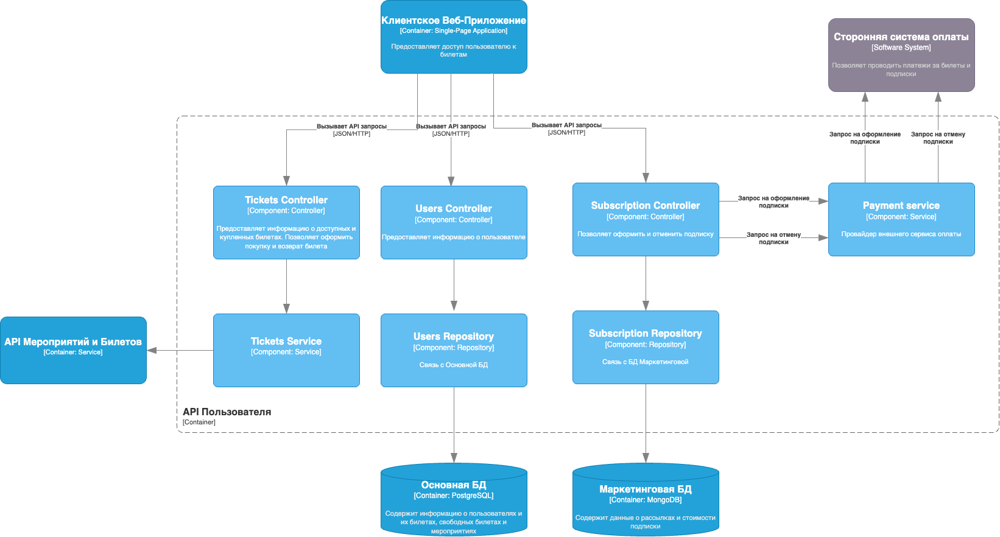
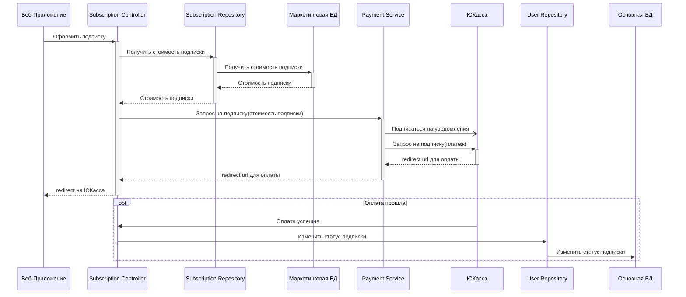

## Описание варианта использования
В качестве основного варианта использования для описания был выбран процесс Оформления подписки пользователем. Для упрощения на диаграмме компонентов показаны не все необходимые связи для выполнения запросов, а лишь основные неоходимые для общего понимания принципа работы. Более подпробно все взаимодействия описаны на диаграмме последовательностей.

Код написан так же с упрощением. Реализованы только те методы, которые необходимы для выполнения требуемоего варианта использования.

## Диаграмма компонентов API Пользователя

## Диаграмма последовательностей для Оформления подписки

Для оплаты используется API ЮКасса. Для этого при запросе оформления подписки пользователю отправляется ответ-redirect на страницу оплаты. Для получения успешного статуса оплаты с помощью API ЮКасса подписываемся на уведомления. Они реализованы с помощью веб хуков. Когда в систему поступает уведомление о том, что оплата прошла, соотвествующая информация сохраняется В БД.

