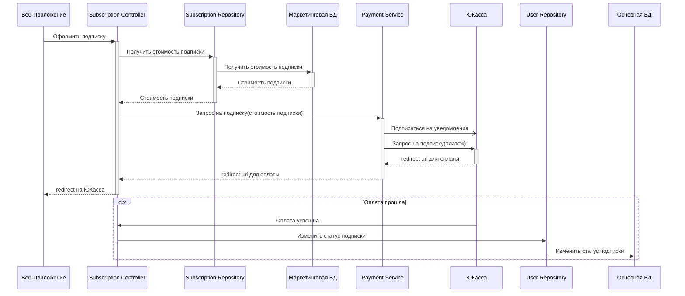
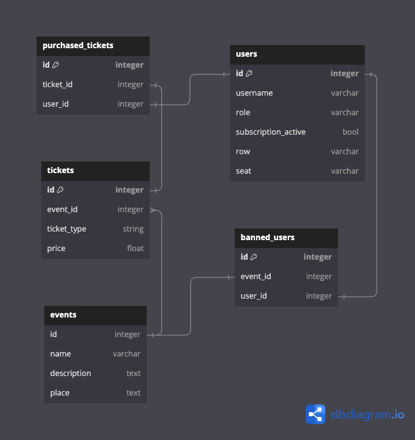

## Описание варианта использования
В качестве основного варианта использования для описания был выбран процесс Оформления подписки пользователем. Для упрощения на диаграмме компонентов показаны не все необходимые связи для выполнения запросов, а лишь основные неоходимые для общего понимания принципа работы. Более подпробно все взаимодействия описаны на диаграмме последовательностей.

Код написан так же с упрощением. Реализованы только те методы, которые необходимы для выполнения требуемоего варианта использования.

## Диаграмма компонентов API Пользователя


## Диаграмма последовательностей для Оформления подписки

Для оплаты используется API ЮКасса. Для этого при запросе оформления подписки пользователю отправляется ответ-redirect на страницу оплаты. Для получения успешного статуса оплаты с помощью API ЮКасса подписываемся на уведомления. Они реализованы с помощью веб хуков. Когда в систему поступает уведомление о том, что оплата прошла, соотвествующая информация сохраняется в БД.



## Модель БД

В данном варианте использования существует обращение только к одной Реляционной БД - Основной БД. Именно ее схема продемонстирована ниже. 

В данной БД должна содержаться информация о следующих понятиях и их характеристиках:

1. Пользователи (Логин, Купленные билеты, Статус подписки, Запрещен ли пользователю вход на мероприятие и Причина)

2. Билет (Мероприятие, Адрес, Тип билета, Ряд (если есть), Место (если есть))

3. Мероприятие (Название, Описание, Адрес, Билеты)

<details><summary>Описание Схемы</summary>

```
Table events {
  id integer
  name varchar
  description text
  place text 
}

Table users {
  id integer [primary key]
  username varchar [unique]
  role varchar
  subscription_active bool
  row varchar
  seat varchar
}

Table tickets {
  id integer [primary key]
  event_id integer [ref: > events.id]
  ticket_type string
  price float
}

Table purchased_tickets {
  id integer [primary key]
  ticket_id integer [ref: - tickets.id]
  user_id integer [ref: > users.id]
}

Table banned_users {
  id integer [primary key]
  event_id integer [ref: > events.id]
  user_id integer [ref: > users.id]
}
```

</details>

### Схема: 



## Описание примененных принципов

Написаный код можно увидеть в папке code. Здесь будут описаны только основные моменты, где были применены соотвествующие принципы.

### YAGNI

В коде сейчас есть всего один способ проведения платежей. Представлен он интерфейсом `IYouKassaPaymentProcessor`. Можно было бы добавить возможность добавлять несколько раздичных способов оплаты, а соотвественно, и их поддержку в коде и легкий способ подстановки этих способов. Но прямо сейчас это не требуется, поэтому было решено отказаться от этого в пользу простоты.

### KISS

Следуя этому принципу код должен быть максимально простым и понятным. Для того, чтобы был таким можно взять себе правило отказаться от длинных методов, классов и больших уровней вложенности. Так и было сделано. В итоге все написанные методы довольно короткие и понятные, а максимальный уровень вложенности в них - второй.

Код был проанализирован с помощью плагина для IDE Rider [Сognitive Сomplexity](https://plugins.jetbrains.com/plugin/12024-cognitivecomplexity). Данный плагин показывает сложность восприятия методов. Все написанные методы получились достаточно простыми для понимания.

### DRY

Данный принцип призывает избегать самокопирования. В написанном коде отсутствует повторение блоков кода и повторная инициализация одинаковых строковых данных. То есть можно сказать, что самоповторение (самокопирование) отсутствует.

### SOLID

Принципы SOLID стоит рассмотреть отдельно по каждой букве.

#### Single Responsibility Principle

Каждый класс должен иметь только одну ответственность. В написанном коде этот принцип соблюдается. Классы предназначенные для работы с БД работают с БД, контроллеры занимаются обработкой запросов пользователя и т.д. 

Например, классы:
 - `SubscriptionController` - отвечает за обработку сетевых запросов,
 - `SubscriptionRepository` - отвечает за работу с данными о подписке.
 

#### Open/Closed Principle

Классы должны быть открыты для расширения, но закрыты для изменения. Хороший пример - хранение пользовательских данных. Для хранения данных не в БД, а например, в файле потребуется не изменять текущий класс для сохранения информации в БД, а создать новую реализацию, которая будет этим заниматься, и зарегистрировать ее.

Пример: с помощью реализаций интерфейса `IPaymentsRepository` можно добавлять новые способы хранения данных об оплате, не изменяя существующий код.

#### Liskov Substitution Principle

Объекты должны быть заменяемыми на своих подтипах без изменения корректности программы. Применение этого принципа не продемонстрировано, так как отстуствует иерархия классов какая-либо.

#### Interface Segregation Principle

Клиенты не должны зависеть от методов, которые они не используют. В данном коде нет классов, которые нереализовывали бы какие-либо методы интерфейсов. Все интерфейсы содержат лишь необходимые методы. Т.е. принцип соблюдается.

#### Dependency Inversion Principle

Зависимости должны зависеть от абстракций, а не от конкретных реализаций. В данном коде контроллеры не зависят от реализаций репозиториев для обращения к БД. Контроллер вообще может не знать, что реализация этого интерфейса изменится. Таким образом принцип выполняется.

## Дополнительные принципы

### BDUF - Big design up front

Данный принцип применим к крупным системам, в которых важно учитывать множество факторов и рисков. При этом требуется большое количество времени и ресурсов на создание детального плана. Это может быть нерационально для создания продукта ради проверки своей идеи. В нашем же случае лучше начать с выпуска MVP на рынок. Таким образом, принцип не подходит нам для использования.

### SoC - Separation оf concerns

Этот принцип гласит, что каждая часть программы должна быть ответственна только за свою функциональность. В целом он уже соблюдался при проектировании архитектуры. Например, все логические блоки разбиты на различные контейнеры-микросервисы.

### MVP - Minimum viable product

Этот принцип гласит, что необходимо создавать минимально жизнеспособный продукт, который содержит только основные функции и возможности. Это позволяет быстро проверить гипотезу о продукте и получить обратную связь от пользователей. Такое подходит для нашего случая. Как раз необходимо проверить работоспособность своей гипотезы. А уже дальше на полученных отзывах понимать, куда дальше развивать продукт.

### PoC - Proof of concept

Необходимо создавать доказательства концепции перед началом разработки. Это позволяет проверить, насколько реализуема идея и какие технологии и инструменты могут быть использованы для ее реализации. В нашей ситуации в целом для конечного результата этот принцип не применим, так как не подходит и не используется.