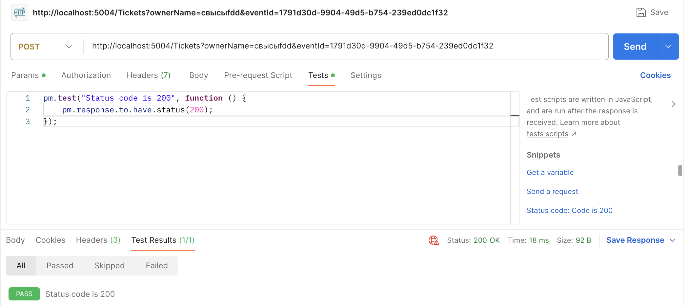

## Описание API

Здесь описаны основные методы API Администратора для работы с билетами. Выбрано именно это API, так как в нем можно реализовать все из необходимых методов.

Для упрощения все методы указаны без авторизации. Предполагается, что авторизация реализуется за счет AuthorizationMiddleware.

## События

Здесь описаны 4 метода для взаимодействия с событиями.

<br>

### GetEvents

**Описание:** 

Получение списка всех событий

**Метод:** GET

**Входные параметры:** НЕТ

**Пример ответа:**

```json
{
    [
        {
            "eventId": "7c1e9fbb-9d14-4a72-bb7c-41f456b047d5",
            "eventName": "event_2"
        },
        {
            "eventId": "e79a7a81-466b-4f11-bacb-ff24cdae0e43",
            "eventName": "event_1"
        }
    ]
}
```

**URL:**
```
GET https://{adress}/Events
```

<br>

### CreateEvent

**Описание:** 

Создание нового события

**Метод:** POST

**Входные параметры:**
| Параметр  | Тип    | Описание    |
|-----------|--------|-------------|
| EventName | string | Имя события |
|           |        |             |

**Пример ответа:** НЕТ

**URL:**
```
POST https://{adress}/Events?eventName={eventName}
```

<br>

### ChangeEventNameOrAdd

**Описание:** 

Изменяет имя события или добавляет новое с таким именем, если ранее не было добавлено.

**Метод:** PUT

**Входные параметры:**
```json
{
  "eventId": "3fa85f64-5717-4562-b3fc-2c963f66afa6",
  "eventName": "string"
}
```

**Пример ответа:** НЕТ

**URL:**
```
PUT https://{adress}/Events
```

<br>

### DeleteEvent

**Описание:** 

Удаляет событие, если оно есть в системе.

**Метод:** DELETE

**Входные параметры:**
| Параметр  | Тип    | Описание   |
|-----------|--------|------------|
|  EventId  |  Guid  | ID события |

**Пример ответа:** НЕТ

**URL:**
```
DELETE https://{adress}/Events?eventId={EventId}
```

<br>

## Билеты

Здесь описаны 4 метода для взаимодействия с событиями.

<br>

### GetTickets

**Описание:** 

Получение списка всех Билетов

**Метод:** GET

**Входные параметры:** НЕТ

**Пример ответа:**

```json
{
    [
        {
           "ticketId": "8d0f00b4-77ac-4545-b479-4b2f33dfa31f",
            "eventId": "1791d30d-9904-49d5-b754-239ed0dc1f66",
            "owner": "вффыф"
        },
        {
            "ticketId": "f4bd0f04-5ccf-4981-b65f-de16c898948c",
            "eventId": "1791d30d-9904-49d5-b754-239ed0dc1f66",
            "owner": "свысы"
        }
    ]
}
```

**URL:**
```
GET https://{adress}/Tickets
```

<br>

### CreateTicket

**Описание:** 

Создание нового билета

**Метод:** POST

**Входные параметры:**
| Параметр  | Тип    | Описание                             |
|-----------|--------|--------------------------------------|
| OwnerName | string | Имя владельца билета                 |
| EventId   | Guid   | ID События, на которое выписан билет |

**Пример ответа:** НЕТ

**URL:**
```
POST https://{adress}//Tickets?ownerName={ownerName}&eventId={eventId}
```

<br>

### ChangeTicketNameOrAdd

**Описание:** 

Изменяет имя владельца билета или событие или добавляет новый билет

**Метод:** PUT

**Входные параметры:**
```json
{
  "TicketId": "3fa85f64-5717-4562-b3fc-2c963f66afa6",
  "eventId": "3fa85f64-5717-4562-b3fc-2c963f66afa6",
  "ownerName": "string"
}
```

**Пример ответа:** НЕТ

**URL:**
```
PUT https://{adress}/Tickets
```

<br>

### DeleteTicket

**Описание:** 

Удаляет событие, если оно есть в системе.

**Метод:** DELETE

**Входные параметры:**
|  Параметр  | Тип    | Описание   |
|------------|--------|------------|
|  TicketId  |  Guid  | ID билета  |

**Пример ответа:** НЕТ

**URL:**
```
DELETE https://{adress}/Tickets?ticketId={TicketId}
```

<br>

## Тестирование с помощью Postman

### GetEvents


<br>

### CreateEvent


<br>

### ChangeEventNameOrAdd


<br>

### DeleteEvent


<br>

### GetTickets


<br>

### CreateTicket




<br>

### ChangeTicketNameOrAdd


<br>

### DeleteTicket


