# Шаблоны проектирования

## Порождающие шаблоны

### Одиночка / Singleton

Одиночка — это порождающий паттерн проектирования, который гарантирует, что у класса есть только один экземпляр, и предоставляет к нему глобальную точку доступа.

**Схема:** 

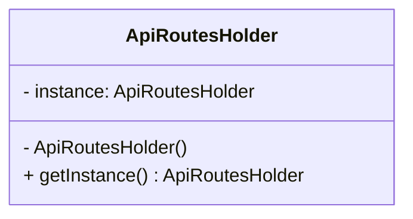

**Код:** 

```
public class ApiRoutesHolder
    {
        private ApiRoutesHolder() { }

        private static ApiRoutesHolder _instance;

        public static ApiRoutesHolder GetInstance()
        {
            if (_instance == null)
            {
                _instance = new ApiRoutesHolder();
            }
            return _instance;
        }

        public string GetEventsApiRoute()
        {
            // ...

            return route;
        }
    }
```

### Фабричный метод / Factory Method

Фабричный метод — это порождающий паттерн проектирования, который определяет общий интерфейс для создания объектов в суперклассе, позволяя подклассам изменять тип создаваемых объектов.

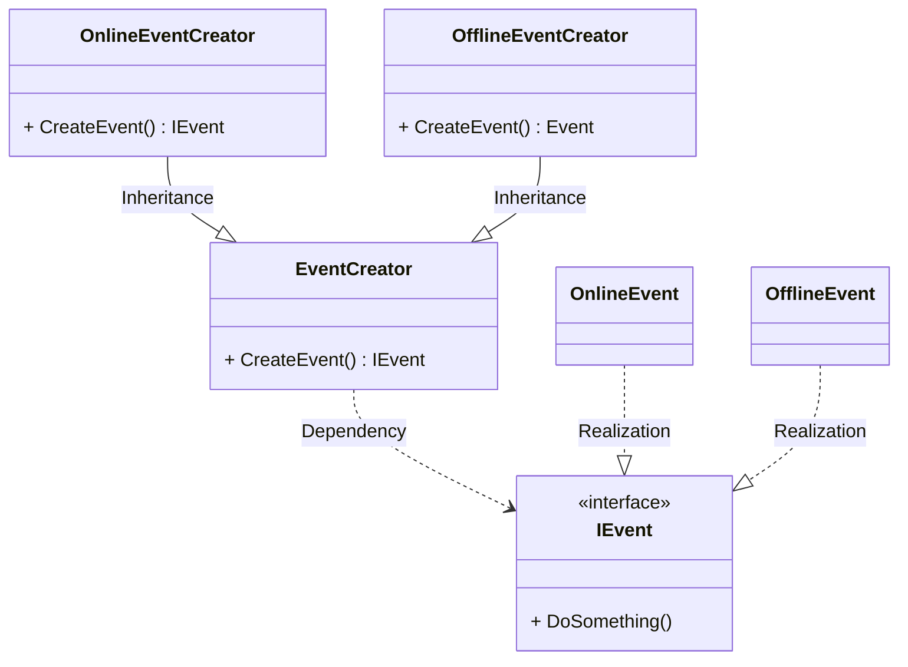

**Код:** 

```
abstract class EventCreator
    {
        public abstract IEvent CreateEvent();
    }

class OnlineEventCreator
    {
        public IEvent CreateEvent()
        {
            var onlineEvent = new OnlineEvent();
            retrun onlineEvent;
        };
    }

class OfflineEventCreator
    {
        public IEvent CreateEvent()
        {
            var offlineEvent = new OfflineEvent();
            retrun offlineEvent;
        };
    }

interface IEvent
    {
        public void DoSomething();
    }

class OnlineEvent : IEvent
    {
        public void DoSomething()
        {
            // do something special for online events...
        };
    }

class OfflineEvent : IEvent
    {
        public void DoSomething()
        {
            // do something special for offline events...
        };
    }
```

### Прототип / Prototype

Прототип — это порождающий паттерн проектирования, который позволяет копировать объекты, не вдаваясь в подробности их реализации.

**Схема:** 

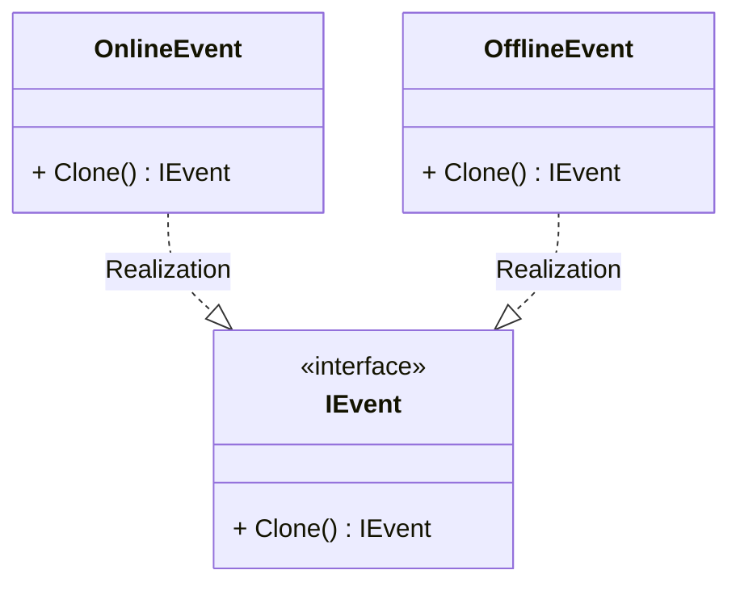

**Код:** 

```
interface IEvent
    {
        public IEvent Clone();
    }

class OnlineEvent : IEvent
    {
        public IEvent Clone()
        {
            // do something special for online events...

            return clone;
        };
    }

class OfflineEvent : IEvent
    {
        public IEvent Clone()
        {
            // do something special for offline events...

             return clone;
        };
    }
```

## Структурные шаблоны

### Фасад / Facade

Фасад — это структурный паттерн проектирования, который предоставляет простой интерфейс к сложной системе классов, библиотеке или фреймворку.

**Схема:** 

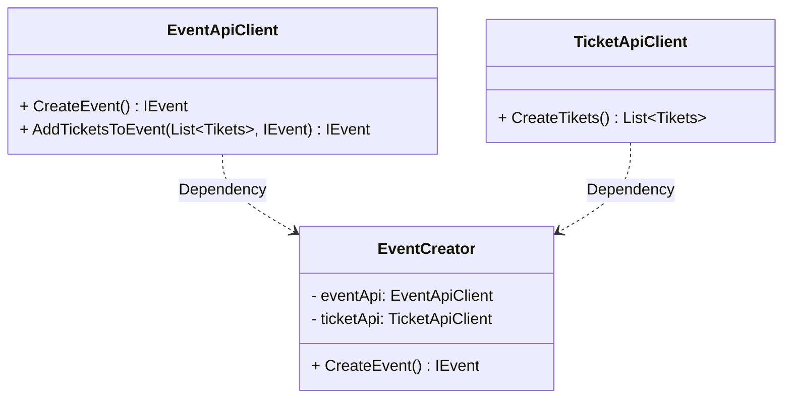

**Код:** 

```
class EventCreator
    {
        private readonly EventApiClient _eventApi;
        private readonly TicketApiClient _ticketApi;

        public IEvent CreateEvent()
        {
            var event = _eventApi.CreateEvent();

            var tickets = _ticketApi.CreateTikets();

            var event = _eventApi.AddTicketsToEvent(tickets, event)
        }
    }

class EventApiClient
    {
        public IEvent CreateEvent()
        {
            // do something ...

            return event;
        };

        public IEvent AddTicketsToEvent(List<Ticket> tickets, IEvent event)
        {
            #просто пример
            event.Tickets = tickets;
            return event;
        }
    }

class TicketApiClient
    {
        public List<Ticket> CreateTikets()
        {
            // do something...

             return ешлуеы;
        };
    }
```

### Адаптер / Adapter

Адаптер — это структурный паттерн проектирования, который позволяет объектам с несовместимыми интерфейсами работать вместе.

**Схема:** 

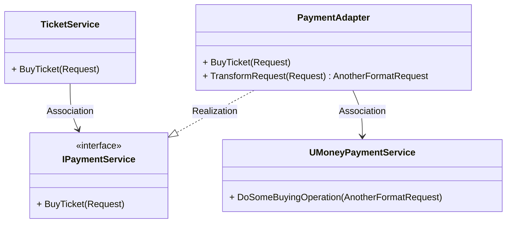

**Код:** 

```
class TicketService
    {
        private readonly IPaymentService _paymentService;

        public void BuyTicket(Request request)
        {
            _paymentService.BuyTickets(request);
        }
    }

interface IPaymentService
    {
        void BuyTicket(Request request);
    }

class PaymentAdapter : IPaymentService
    {
        private readonly UMoneyPaymentService _uMoneyPaymentService;

        public void BuyTicket(Request request)
        {
            var anotherFormatRequest = TransformRequest(request);
            _uMoneyPaymentService.DoSomeBuyingOperation(anotherFormatRequest);
        }

        public AnotherFormatRequest TransformRequest(Request request)
        {
            var anotherFormatRequest = DoSomeTRansform(request);
        }
    }
```

### Заместитель / Proxy

Заместитель — это структурный паттерн проектирования, который позволяет подставлять вместо реальных объектов специальные объекты-заменители. Эти объекты перехватывают вызовы к оригинальному объекту, позволяя сделать что-то до или после передачи вызова оригиналу.

**Схема:** 

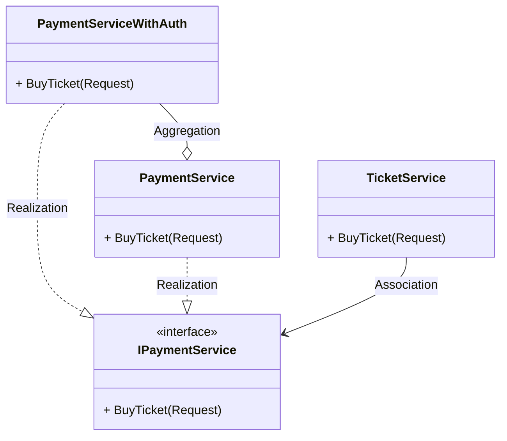

**Код:** 

```
class TicketService
    {
        private readonly IPaymentService _paymentService;

        public void BuyTicket(Request request)
        {
            _paymentService.BuyTickets(request);
        }
    }

interface IPaymentService
    {
        void BuyTicket(Request request);
    }

class PaymentServiceWithAuth : IPaymentService
    {
        private readonly IPaymentService _paymentService;

        public void BuyTicket(Request request)
        {
            if (!CheckAuth())
                return;

            _paymentService.BuyTIckets(request)
        }
    }

class PaymentService : IPaymentService
    {
        public void BuyTicket(Request request)
        {
            DoSomeBuyOperations(request);
        }
    }
```

### Мост / Bridge

Мост — это структурный паттерн проектирования, который разделяет один или несколько классов на две отдельные иерархии — абстракцию и реализацию, позволяя изменять их независимо друг от друга.

**Схема:** 

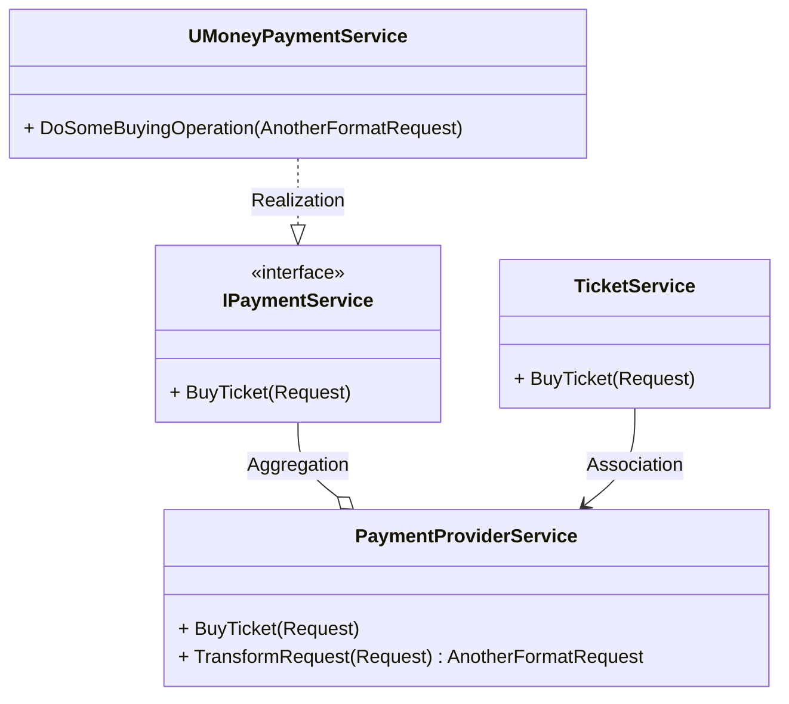

**Код:** 

```
class TicketService
    {
        private readonly PaymentProviderService _paymentProviderService;

        public void BuyTicket(Request request)
        {
            _paymentProviderService.BuyTickets(request);
        }
    }

interface IPaymentService
    {
        void BuyTicket(Request request);
    }

class PaymentProviderService
    {
        public PaymentProviderService(IPaymentService paymentService)
        {
            _paymentService = paymentService;
        }

        private readonly IPaymentService _paymentService;

        public void BuyTicket(Request request)
        {
            _paymentService.BuyTicket(anotherFormatRequest);
        }
    }

class UMoneyPaymentService : IPaymentService
    {
        public void BuyTicket(Request request)
        {
            DoSomeBuyOperations(request);
        }
    }
```

## Поведенческие шаблоны

### Команда / Command

Команда — это поведенческий паттерн проектирования, который превращает запросы в объекты, позволяя передавать их как аргументы при вызове методов, ставить запросы в очередь, логировать их, а также поддерживать отмену операций.

**Схема:** 

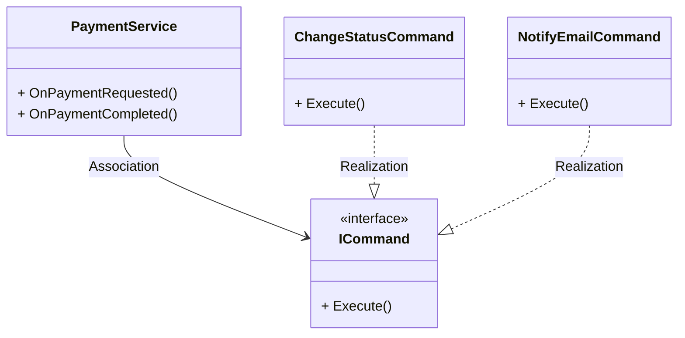

**Код:** 

```
class PaymentService
    {
        private readonly ICommand _onPaymentRequestedCommand = new ChangeStatusCommand();
        private readonly ICommand _onPaymentCompletedCommand = new NotifyEmailCommand();

        public void OnPaymentRequested() => _onPaymentRequestedCommand.Execute();
        public void OnPaymentCompleted() => _onPaymentCompletedCommand.Execute();
    }

interface ICommand
    {
        void Execute();
    }

class ChangeStatusCommand : ICommand
    {
        public void Execute()
        {
            // do some staff to change status
        };
    }

class NotifyEmailCommand : ICommand
    {
        public void Execute()
        {
            // send email notification to user by email/
        };
    }
```

### Состояние / State

Состояние — это поведенческий паттерн проектирования, который позволяет объектам менять поведение в зависимости от своего состояния. Извне создаётся впечатление, что изменился класс объекта.

**Схема:** 

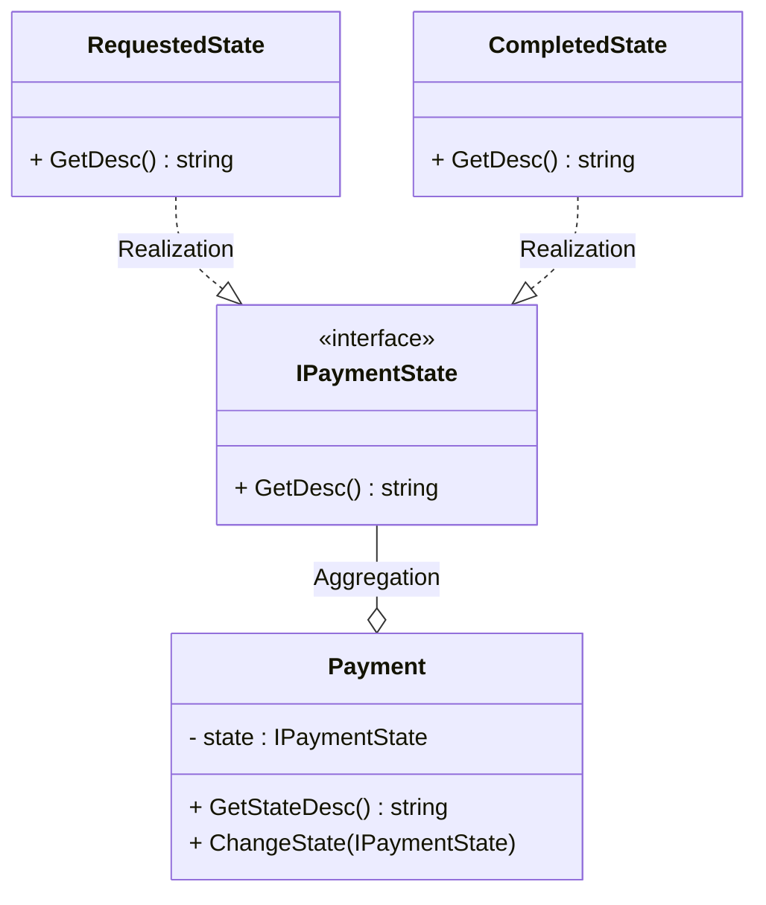

**Код:** 

```
class Payment
    {
        private IPaymentState _state;

        public string GetStateDesc()
        {
            return _state.GetDesc();
        }
    }

interface IPaymentState
    {
        string GetDesc();
    }

class RequestedState : IPaymentState
    {
        public string GetDesc()
        {
            return "payment is requested";
        };
    }

class CompletedState : IPaymentState
    {
        public string GetDesc()
        {
            return "payment is completed";
        };
    }
```

### Стратегия / Strategy

Стратегия — это поведенческий паттерн проектирования, который определяет семейство схожих алгоритмов и помещает каждый из них в собственный класс, после чего алгоритмы можно взаимозаменять прямо во время исполнения программы.

**Схема:** 

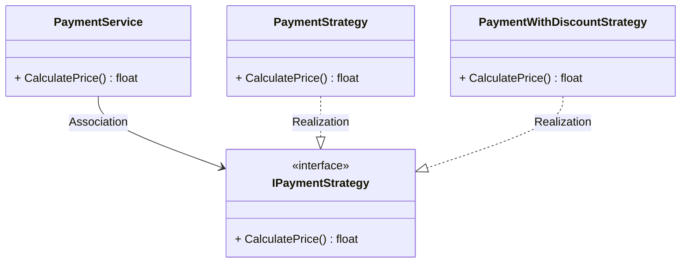

**Код:** 

```
class PaymentService
    {
        private readonly IPaymentStrategy _paymentStrategy;

        public float CalculatePrice()
        {
            return _paymentStrategy.CalculatePrice()
        }
    }

interface IPaymentStrategy
    {
        float CalculatePrice();
    }

class PaymentStrategy : IPaymentStrategy
    {
        public float CalculatePrice()
        {
            return fullPrice;
        }
    }

class PaymentWithDiscountStrategy : IPaymentStrategy
    {
        public float CalculatePrice()
        {
            return fullPrice * 0.8;
        }
    }
```

### Шаблонный метод / Template Method

Шаблонный метод — это поведенческий паттерн проектирования, который определяет скелет алгоритма, перекладывая ответственность за некоторые его шаги на подклассы. Паттерн позволяет подклассам переопределять шаги алгоритма, не меняя его общей структуры.

**Схема:** 

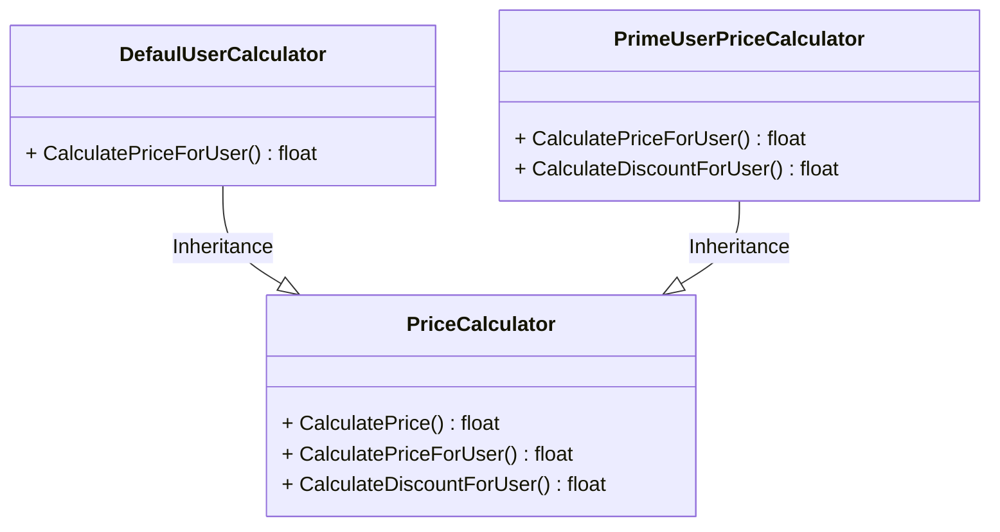

**Код:** 

```
abstract class PriceCalculator
    {
        public float CalculatePrice()
        {
           var basePrice = CalculatePriceForUser();
           var discount = CalculateDiscountForUser();
        }

        public virtual float CalculatePriceForUser()
        {
            return defaultPrice();
        }

        public abstract float CalculateDiscountForUser();
    }

class DefaulUserCalculator : PriceCalculator
    {
        public override float CalculateDiscountForUser()
        {
            return 0.9;
        }
    }

class PrimeUserPriceCalculator : PriceCalculator
    {
        public override float CalculatePriceForUser()
        {
            return priceForPrimeUser;
        }

        public override float CalculateDiscountForUser()
        {
            return 0.7;
        }
    }
```

### Наблюдатель / Observer

Наблюдатель — это поведенческий паттерн проектирования, который создаёт механизм подписки, позволяющий одним объектам следить и реагировать на события, происходящие в других объектах.

**Схема:** 

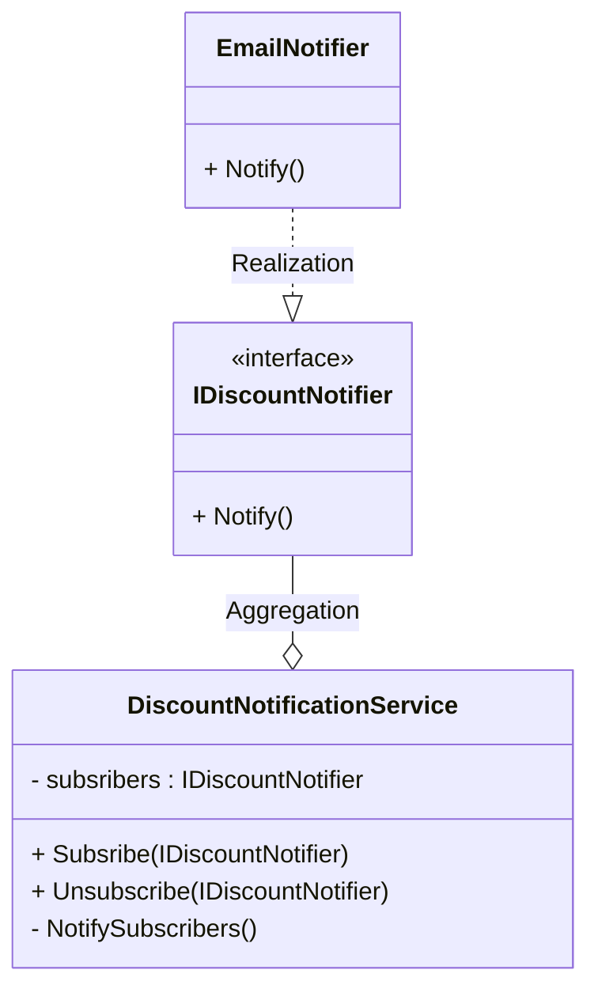

**Код:** 

```
class DiscountNotificationService
    {
        private readonly List<IDiscountNotifier> _subscribers = new();

        public Subscribe(IDiscountNotifier notifier)
        {
           _subscribers.Add(notifier)
        }

        public Unsubscribe(IDiscountNotifier notifier)
        {
           _subscribers.Remove(notifier)
        }

        private NotifySubscribers()
        {
           foreach (var subscribers in _subscribers)
                subsriber.Notify()
        }
    }

interface IDiscountNotifier
    {
        void Notify()
    }

class EmailNotifier : IDiscountNotifier
    {
        public void Notify()
        {
            // notify users by email
        }
    }
```